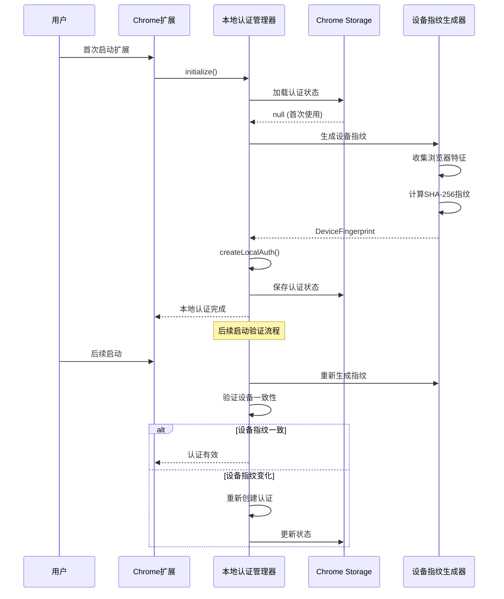
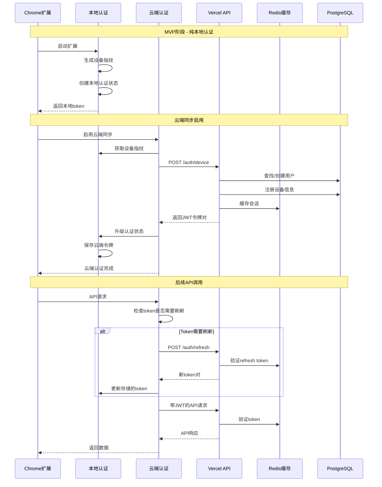

# Backend Architecture

## Service Architecture

### Serverless Architecture

```text
apps/sync-api/api/
├── auth/
│   └── device.ts                  # 设备认证端点
├── sync/
│   ├── bookmarks.ts              # 书签批量同步
│   ├── status.ts                 # 同步状态查询
│   └── resolve-conflict.ts       # 冲突解决
└── bookmarks/
    └── [id].ts                   # 单个书签CRUD
```

### Function Template

```typescript
// Vercel Edge Function 基础模板
async function syncBookmarksHandler(
  req: NextRequest,
  context: { user: AuthUser }
): Promise<NextResponse> {
  if (req.method !== 'POST') {
    return NextResponse.json(
      { error: { code: 'METHOD_NOT_ALLOWED', message: '仅支持POST请求' } },
      { status: 405 }
    );
  }

  try {
    const body: SyncRequest = await req.json();
    const syncService = new SyncService(context.user);
    const result = await syncService.processSyncRequest(body);

    if (result.conflicts.length > 0) {
      return NextResponse.json({
        error: { code: 'SYNC_CONFLICT', message: '检测到数据冲突' },
        conflicts: result.conflicts,
      }, { status: 409 });
    }

    return NextResponse.json({
      success: true,
      syncedBookmarks: result.syncedBookmarks,
      nextSyncToken: result.nextSyncToken,
    });
  } catch (error) {
    return NextResponse.json(
      { error: { code: 'INTERNAL_ERROR', message: '服务器内部错误' } },
      { status: 500 }
    );
  }
}
```

## Auth Architecture

### 认证架构概述

BMad Link采用**渐进式身份验证架构**，支持从MVP阶段的纯本地认证无缝过渡到云端同步阶段的完整JWT认证体系。

**设计原则：**
- **隐私优先：** MVP阶段无需任何云端认证，完全本地运行
- **无缝升级：** 启用云端同步时自动升级认证级别，无需重新设置
- **设备绑定：** 基于浏览器指纹的强设备认证，支持多设备管理
- **安全防护：** CSRF保护、速率限制、异常检测等多重安全机制

### MVP阶段：本地设备认证

**目标：**为扩展提供唯一设备标识，支持本地数据隔离和状态管理

**核心组件：**
- **设备指纹生成器：** 基于浏览器特征生成稳定的设备ID
- **本地认证管理器：** 管理设备认证状态和本地伪token
- **Chrome存储集成：** 安全存储认证状态到chrome.storage.local



### 云端同步阶段：完整JWT认证体系

**目标：**提供企业级的身份验证和授权，支持跨设备同步和安全的API访问

**核心组件：**
- **JWT令牌管理器：** 生成、验证、刷新JWT访问令牌
- **设备认证服务：** 基于设备指纹的无密码认证
- **会话管理：** Redis缓存的高性能会话存储
- **安全管理器：** CSRF保护、速率限制、异常检测



### 设备指纹算法

**指纹组件（按稳定性排序）：**

| 组件 | 稳定性 | 权重 | 说明 |
|------|--------|------|------|
| 扩展ID | 极高 | 25% | Chrome扩展的唯一标识符 |
| 用户代理 | 高 | 20% | 浏览器和操作系统信息 |
| 屏幕分辨率 | 高 | 15% | 主显示器分辨率 |
| 时区 | 高 | 15% | 系统时区设置 |
| 硬件并发 | 中 | 10% | CPU核心数量 |
| Canvas指纹 | 中 | 10% | 图形渲染特征 |
| 音频指纹 | 低 | 5% | 音频上下文特征 |

**指纹生成算法：**
```typescript
// 使用稳定组件生成主指纹，动态组件用于增强唯一性
const stableComponents = {
  extensionId: chrome.runtime.id,
  userAgent: navigator.userAgent,
  screenResolution: `${screen.width}x${screen.height}`,
  timezone: Intl.DateTimeFormat().resolvedOptions().timeZone,
  platform: navigator.platform
};

// SHA-256散列生成64字符设备ID
const deviceId = await crypto.subtle.digest('SHA-256', 
  new TextEncoder().encode(JSON.stringify(stableComponents))
);
```

### JWT令牌结构

**访问令牌Payload：**
```json
{
  "iss": "bmad-link",
  "sub": "user_uuid",
  "aud": "bmad-link-extension",
  "exp": 1640995200,
  "iat": 1640991600,
  "nbf": 1640991600,
  "jti": "token_uuid",
  "deviceId": "device_fingerprint_hash",
  "authLevel": "cloud",
  "permissions": ["bookmark:read", "bookmark:write", "sync:read", "sync:write"],
  "sessionId": "session_uuid"
}
```

**令牌管理策略：**
- **访问令牌过期：** 1小时
- **刷新令牌过期：** 30天
- **自动刷新阈值：** 提前5分钟
- **令牌轮换：** 每24小时强制轮换

### 安全防护机制

**CSRF保护：**
- 所有状态变更操作要求CSRF令牌
- 令牌通过secure cookie或请求头传输
- 时间安全比较防止时序攻击

**速率限制：**
- 认证请求：每IP每分钟5次
- API请求：每用户每分钟100次
- 同步请求：每设备每分钟50次
- 滑动窗口算法，Redis存储计数器

**异常检测：**
- IP地址变化检测（30分风险评分）
- 浏览器指纹变化（20分风险评分）
- 异常活动频率（40分风险评分）
- 设备特征漂移（25分风险评分）
- 风险评分≥50触发额外验证

**会话管理：**
- Redis存储活跃会话，7天TTL
- 支持单点登出和全设备登出
- 会话劫持检测（IP+UserAgent验证）
- 并发会话限制（每用户最多5个设备）
