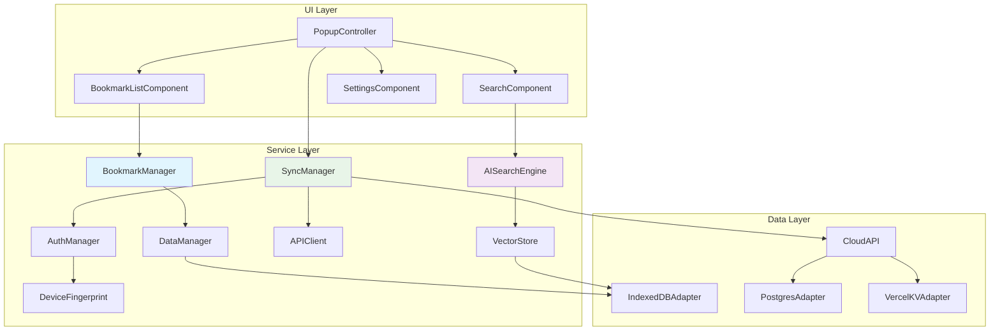

# BMad Link 组件接口契约

## 架构概述

BMad Link采用分层组件架构，明确定义各组件间的接口契约。每个组件都有清晰的职责边界、输入输出规范和错误处理策略。

### 核心设计原则

- **单一职责**：每个组件专注一个核心功能
- **明确契约**：所有接口都有详细的类型定义和行为规范
- **错误隔离**：组件失败不影响其他组件运行
- **可测试性**：所有接口都支持mock和单元测试
- **向后兼容**：接口变更遵循语义化版本管理

## 核心组件架构图



## 1. AISearchEngine - AI搜索引擎

### 接口定义

```typescript
interface AISearchEngine {
  // 初始化和生命周期管理
  initialize(config: AIEngineConfig): Promise<void>;
  dispose(): Promise<void>;
  isInitialized(): boolean;
  getModelInfo(): AIModelInfo;
  
  // 核心搜索功能
  searchBookmarks(query: SearchQuery, context: SearchContext): Promise<SearchResult[]>;
  generateVector(text: string, options?: VectorOptions): Promise<Float32Array>;
  calculateSimilarity(vector1: Float32Array, vector2: Float32Array): number;
  
  // 批量处理
  batchVectorize(texts: string[], options?: BatchVectorOptions): Promise<VectorBatch>;
  batchSearch(queries: SearchQuery[], context: SearchContext): Promise<BatchSearchResult>;
  
  // 模型管理
  updateModel(modelUrl: string): Promise<void>;
  validateModel(): Promise<ModelValidation>;
  
  // 性能和监控
  getPerformanceMetrics(): AIPerformanceMetrics;
  clearCache(): void;
}

// 配置和数据类型
interface AIEngineConfig {
  modelUrl: string;                    // 模型下载地址
  modelVersion: string;               // 模型版本
  maxConcurrentOperations: number;    // 最大并发操作数
  vectorDimensions: number;           // 向量维度（512）
  
  // 性能配置
  batchSize: number;                  // 批处理大小
  cacheSize: number;                  // 缓存大小（MB）
  timeout: number;                    // 操作超时时间（毫秒）
  
  // 高级配置
  useWebGL: boolean;                  // 是否使用WebGL加速
  debugMode: boolean;                 // 调试模式
  fallbackEnabled: boolean;           // 启用降级功能
}

interface SearchQuery {
  text: string;                       // 查询文本
  type: 'semantic' | 'keyword' | 'hybrid';
  filters?: SearchFilters;            // 搜索过滤器
  options?: SearchOptions;            // 搜索选项
}

interface SearchContext {
  bookmarks: Bookmark[];              // 待搜索书签
  maxResults: number;                 // 最大结果数
  minSimilarity: number;             // 最小相似度阈值
  userPreferences?: UserSearchPrefs;  // 用户偏好
}

interface SearchResult {
  bookmark: Bookmark;                 // 书签数据
  score: number;                     // 相似度分数 0-1
  reasons: MatchReason[];            // 匹配原因
  highlights: TextHighlight[];       // 文本高亮
}

interface AIPerformanceMetrics {
  modelLoadTime: number;             // 模型加载时间
  averageSearchTime: number;         // 平均搜索时间
  averageVectorTime: number;         // 平均向量生成时间
  cacheHitRate: number;              // 缓存命中率
  memoryUsage: number;               // 内存使用量
  operationsPerSecond: number;       // 每秒操作数
  errorRate: number;                 // 错误率
}
```

### 实现规范

```typescript
class TensorFlowAISearchEngine implements AISearchEngine {
  private model: tf.LayersModel | null = null;
  private vectorCache = new Map<string, Float32Array>();
  private performanceTracker = new AIPerformanceTracker();
  
  async initialize(config: AIEngineConfig): Promise<void> {
    this.performanceTracker.startOperation('model_load');
    
    try {
      // 验证配置
      this.validateConfig(config);
      
      // 加载TensorFlow.js模型
      this.model = await tf.loadLayersModel(config.modelUrl);
      
      // 预热模型
      await this.warmupModel();
      
      // 初始化缓存
      this.initializeCache(config.cacheSize);
      
      this.performanceTracker.endOperation('model_load');
      
      console.info('AI搜索引擎初始化完成', {
        modelVersion: config.modelVersion,
        vectorDimensions: config.vectorDimensions,
        loadTime: this.performanceTracker.getLastOperationTime('model_load')
      });
      
    } catch (error) {
      this.performanceTracker.recordError('model_load', error);
      throw new AIEngineError('MODEL_LOAD_FAILED', error.message);
    }
  }
  
  async searchBookmarks(query: SearchQuery, context: SearchContext): Promise<SearchResult[]> {
    if (!this.isInitialized()) {
      throw new AIEngineError('ENGINE_NOT_INITIALIZED', '搜索引擎未初始化');
    }
    
    this.performanceTracker.startOperation('search');
    
    try {
      // 1. 生成查询向量
      const queryVector = await this.generateVector(query.text);
      
      // 2. 并行计算相似度
      const similarities = await this.calculateSimilarities(queryVector, context.bookmarks);
      
      // 3. 过滤和排序结果
      const filteredResults = this.filterAndRankResults(similarities, context);
      
      // 4. 生成匹配原因和高亮
      const enrichedResults = await this.enrichResults(filteredResults, query);
      
      this.performanceTracker.endOperation('search');
      
      return enrichedResults;
      
    } catch (error) {
      this.performanceTracker.recordError('search', error);
      
      // 降级处理
      if (this.config.fallbackEnabled) {
        return await this.fallbackSearch(query, context);
      }
      
      throw new AIEngineError('SEARCH_FAILED', error.message);
    }
  }
  
  async generateVector(text: string, options?: VectorOptions): Promise<Float32Array> {
    const cacheKey = this.generateCacheKey(text, options);
    
    // 检查缓存
    const cached = this.vectorCache.get(cacheKey);
    if (cached) {
      return cached;
    }
    
    this.performanceTracker.startOperation('vector_generation');
    
    try {
      // 预处理文本
      const processedText = this.preprocessText(text);
      
      // 使用模型生成向量
      const tensor = tf.tensor1d([processedText]);
      const prediction = this.model!.predict(tensor) as tf.Tensor;
      const vector = new Float32Array(await prediction.data());
      
      // 清理tensor
      tensor.dispose();
      prediction.dispose();
      
      // 缓存结果
      this.vectorCache.set(cacheKey, vector);
      
      this.performanceTracker.endOperation('vector_generation');
      
      return vector;
      
    } catch (error) {
      this.performanceTracker.recordError('vector_generation', error);
      throw new AIEngineError('VECTOR_GENERATION_FAILED', error.message);
    }
  }
  
  // 性能监控和指标收集
  getPerformanceMetrics(): AIPerformanceMetrics {
    return {
      modelLoadTime: this.performanceTracker.getOperationTime('model_load'),
      averageSearchTime: this.performanceTracker.getAverageOperationTime('search'),
      averageVectorTime: this.performanceTracker.getAverageOperationTime('vector_generation'),
      cacheHitRate: this.calculateCacheHitRate(),
      memoryUsage: this.estimateMemoryUsage(),
      operationsPerSecond: this.performanceTracker.getOperationsPerSecond(),
      errorRate: this.performanceTracker.getErrorRate()
    };
  }
  
  private async fallbackSearch(query: SearchQuery, context: SearchContext): Promise<SearchResult[]> {
    // 关键词搜索降级逻辑
    const keywords = this.extractKeywords(query.text);
    
    const results = context.bookmarks
      .map(bookmark => ({
        bookmark,
        score: this.calculateKeywordScore(keywords, bookmark),
        reasons: [{ type: 'KEYWORD_MATCH', confidence: 0.6 }],
        highlights: this.generateKeywordHighlights(keywords, bookmark)
      }))
      .filter(result => result.score > 0.3)
      .sort((a, b) => b.score - a.score)
      .slice(0, context.maxResults);
      
    return results;
  }
}
```

## 2. SyncManager - 同步管理器

### 接口定义

```typescript
interface SyncManager {
  // 同步状态管理
  enableSync(credentials: SyncCredentials): Promise<void>;
  disableSync(): Promise<void>;
  getSyncStatus(): SyncStatus;
  
  // 数据同步
  syncNow(options?: SyncOptions): Promise<SyncResult>;
  scheduleBatchSync(delay: number): Promise<void>;
  cancelPendingSync(): void;
  
  // 冲突处理
  getConflicts(): Promise<ConflictData[]>;
  resolveConflict(conflictId: string, resolution: ConflictResolution): Promise<void>;
  
  // 事件监听
  onSyncStart(callback: (event: SyncStartEvent) => void): void;
  onSyncComplete(callback: (result: SyncResult) => void): void;
  onConflictDetected(callback: (conflict: ConflictData) => void): void;
  
  // 配置管理
  updateSyncSettings(settings: SyncSettings): Promise<void>;
  getSyncSettings(): SyncSettings;
}

interface SyncCredentials {
  deviceId: string;                   // 设备标识
  accessToken: string;               // 访问令牌
  refreshToken: string;              // 刷新令牌
  serverUrl: string;                 // 服务器地址
}

interface SyncStatus {
  enabled: boolean;                  // 是否启用同步
  status: 'idle' | 'syncing' | 'error' | 'conflict';
  lastSyncTime: number | null;       // 上次同步时间
  pendingChanges: number;           // 待同步变更数
  conflictCount: number;            // 冲突数量
  error?: SyncError;                // 最后错误
}

interface SyncResult {
  success: boolean;                 // 同步是否成功
  timestamp: number;               // 同步时间
  
  // 统计信息
  totalBookmarks: number;          // 总书签数
  uploaded: number;                // 上传数量
  downloaded: number;              // 下载数量
  conflicts: number;               // 冲突数量
  errors: number;                  // 错误数量
  
  // 详细结果
  uploadResults: UploadResult[];   // 上传结果
  downloadResults: DownloadResult[]; // 下载结果
  conflicts: ConflictData[];       // 冲突数据
  errors: SyncError[];            // 错误列表
}

interface ConflictData {
  id: string;                      // 冲突标识
  bookmarkId: string;             // 书签ID
  type: ConflictType;             // 冲突类型
  
  localVersion: BookmarkVersion;   // 本地版本
  remoteVersion: BookmarkVersion;  // 远程版本
  
  detectedAt: number;             // 发现时间
  severity: 'low' | 'medium' | 'high'; // 严重程度
  autoResolvable: boolean;        // 是否可自动解决
  
  suggestedResolution?: ConflictResolution; // 建议解决方案
}
```

### 实现规范

```typescript
class CloudSyncManager implements SyncManager {
  private syncState: SyncStatus = {
    enabled: false,
    status: 'idle',
    lastSyncTime: null,
    pendingChanges: 0,
    conflictCount: 0
  };
  
  private eventEmitter = new EventEmitter();
  private syncQueue: SyncOperation[] = [];
  private conflictResolver = new ConflictResolver();
  
  async enableSync(credentials: SyncCredentials): Promise<void> {
    try {
      // 验证凭据
      await this.validateCredentials(credentials);
      
      // 存储凭据
      await this.storeCredentials(credentials);
      
      // 初始化同步状态
      this.syncState.enabled = true;
      this.syncState.status = 'idle';
      
      // 执行首次同步
      await this.performInitialSync();
      
      // 启动定期同步
      this.startPeriodicSync();
      
      this.eventEmitter.emit('sync-enabled');
      
    } catch (error) {
      this.syncState.error = new SyncError('ENABLE_SYNC_FAILED', error.message);
      throw error;
    }
  }
  
  async syncNow(options: SyncOptions = {}): Promise<SyncResult> {
    if (!this.syncState.enabled) {
      throw new SyncError('SYNC_NOT_ENABLED', '同步未启用');
    }
    
    if (this.syncState.status === 'syncing') {
      throw new SyncError('SYNC_IN_PROGRESS', '正在同步中');
    }
    
    this.updateSyncStatus('syncing');
    this.eventEmitter.emit('sync-start', { timestamp: Date.now() });
    
    try {
      const result = await this.performSync(options);
      
      this.updateSyncStatus('idle');
      this.syncState.lastSyncTime = Date.now();
      
      this.eventEmitter.emit('sync-complete', result);
      
      return result;
      
    } catch (error) {
      this.updateSyncStatus('error');
      this.syncState.error = error instanceof SyncError ? error : 
        new SyncError('SYNC_FAILED', error.message);
      
      this.eventEmitter.emit('sync-error', this.syncState.error);
      
      throw this.syncState.error;
    }
  }
  
  private async performSync(options: SyncOptions): Promise<SyncResult> {
    const startTime = Date.now();
    const result: SyncResult = {
      success: false,
      timestamp: startTime,
      totalBookmarks: 0,
      uploaded: 0,
      downloaded: 0,
      conflicts: 0,
      errors: 0,
      uploadResults: [],
      downloadResults: [],
      conflicts: [],
      errors: []
    };
    
    try {
      // 1. 获取本地变更
      const localChanges = await this.getLocalChanges();
      
      // 2. 获取远程变更
      const remoteChanges = await this.getRemoteChanges();
      
      // 3. 检测冲突
      const conflicts = await this.detectConflicts(localChanges, remoteChanges);
      
      if (conflicts.length > 0) {
        result.conflicts = conflicts;
        
        // 自动解决简单冲突
        const autoResolved = await this.autoResolveConflicts(conflicts);
        result.conflicts = conflicts.filter(c => !autoResolved.includes(c.id));
        
        if (result.conflicts.length > 0) {
          this.updateSyncStatus('conflict');
          result.conflicts.forEach(conflict => 
            this.eventEmitter.emit('conflict-detected', conflict)
          );
        }
      }
      
      // 4. 上传本地变更
      if (localChanges.length > 0) {
        result.uploadResults = await this.uploadChanges(localChanges);
        result.uploaded = result.uploadResults.filter(r => r.success).length;
        result.errors += result.uploadResults.filter(r => !r.success).length;
      }
      
      // 5. 下载远程变更
      if (remoteChanges.length > 0) {
        result.downloadResults = await this.downloadChanges(remoteChanges);
        result.downloaded = result.downloadResults.filter(r => r.success).length;
        result.errors += result.downloadResults.filter(r => !r.success).length;
      }
      
      // 6. 更新同步元数据
      await this.updateSyncMetadata(result);
      
      result.success = result.errors === 0 && result.conflicts.length === 0;
      result.totalBookmarks = await this.getTotalBookmarkCount();
      
      return result;
      
    } catch (error) {
      result.errors.push(new SyncError('SYNC_OPERATION_FAILED', error.message));
      result.errors++;
      throw error;
    }
  }
  
  async resolveConflict(conflictId: string, resolution: ConflictResolution): Promise<void> {
    const conflict = await this.getConflict(conflictId);
    if (!conflict) {
      throw new SyncError('CONFLICT_NOT_FOUND', `冲突 ${conflictId} 不存在`);
    }
    
    try {
      await this.conflictResolver.resolve(conflict, resolution);
      
      // 移除已解决的冲突
      await this.removeConflict(conflictId);
      
      // 更新冲突计数
      this.syncState.conflictCount = Math.max(0, this.syncState.conflictCount - 1);
      
      // 如果所有冲突已解决，恢复idle状态
      if (this.syncState.conflictCount === 0 && this.syncState.status === 'conflict') {
        this.updateSyncStatus('idle');
      }
      
      this.eventEmitter.emit('conflict-resolved', { conflictId, resolution });
      
    } catch (error) {
      throw new SyncError('CONFLICT_RESOLUTION_FAILED', error.message);
    }
  }
}
```

## 3. DataManager - 数据管理器

### 接口定义

```typescript
interface DataManager {
  // 书签CRUD操作
  createBookmark(bookmark: CreateBookmarkRequest): Promise<Bookmark>;
  getBookmark(id: string): Promise<Bookmark | null>;
  updateBookmark(id: string, updates: UpdateBookmarkRequest): Promise<Bookmark>;
  deleteBookmark(id: string): Promise<void>;
  
  // 批量操作
  getBatch(ids: string[]): Promise<Bookmark[]>;
  createBatch(bookmarks: CreateBookmarkRequest[]): Promise<Bookmark[]>;
  updateBatch(updates: BatchUpdateRequest[]): Promise<Bookmark[]>;
  deleteBatch(ids: string[]): Promise<void>;
  
  // 查询操作
  getAllBookmarks(options?: QueryOptions): Promise<Bookmark[]>;
  searchBookmarks(query: string, options?: SearchOptions): Promise<Bookmark[]>;
  getBookmarksByTag(tag: string): Promise<Bookmark[]>;
  getRecentBookmarks(limit: number): Promise<Bookmark[]>;
  
  // 统计信息
  getBookmarkCount(): Promise<number>;
  getStorageUsage(): Promise<StorageInfo>;
  
  // 数据验证和清理
  validateBookmark(bookmark: Partial<Bookmark>): ValidationResult;
  cleanupOrphanedData(): Promise<CleanupResult>;
  
  // 事件监听
  onBookmarkCreated(callback: (bookmark: Bookmark) => void): void;
  onBookmarkUpdated(callback: (bookmark: Bookmark, changes: BookmarkChanges) => void): void;
  onBookmarkDeleted(callback: (id: string) => void): void;
}

interface CreateBookmarkRequest {
  url: string;                        // 必填：书签URL
  title: string;                      // 必填：书签标题
  description?: string;               // 可选：描述
  content?: string;                   // 可选：网页内容
  tags?: string[];                    // 可选：标签
  favicon?: string;                   // 可选：图标
  contentType?: ContentType;          // 可选：内容类型
}

interface UpdateBookmarkRequest {
  title?: string;                     // 更新标题
  description?: string;               // 更新描述
  tags?: string[];                    // 更新标签
  isArchived?: boolean;              // 更新归档状态
  isFavorite?: boolean;              // 更新收藏状态
}

interface QueryOptions {
  limit?: number;                     // 限制数量
  offset?: number;                    // 偏移量
  sortBy?: 'created' | 'updated' | 'accessed' | 'title';
  sortOrder?: 'asc' | 'desc';        // 排序方向
  includeArchived?: boolean;          // 包含归档
  tags?: string[];                    // 标签过滤
  contentTypes?: ContentType[];       // 内容类型过滤
}

interface ValidationResult {
  valid: boolean;                     // 是否有效
  errors: ValidationError[];          // 验证错误
  warnings: ValidationWarning[];      // 验证警告
}
```

### 实现规范

```typescript
class IndexedDBDataManager implements DataManager {
  private db: IDBDatabase | null = null;
  private eventEmitter = new EventEmitter();
  private validator = new BookmarkValidator();
  
  async initialize(): Promise<void> {
    if (this.db) return;
    
    try {
      this.db = await this.openDatabase();
      this.setupEventListeners();
      
    } catch (error) {
      throw new DataManagerError('INITIALIZATION_FAILED', error.message);
    }
  }
  
  async createBookmark(request: CreateBookmarkRequest): Promise<Bookmark> {
    // 1. 验证输入
    const validation = this.validator.validateCreateRequest(request);
    if (!validation.valid) {
      throw new DataManagerError('VALIDATION_FAILED', validation.errors[0].message);
    }
    
    // 2. 检查URL是否已存在
    const existing = await this.findByUrl(request.url);
    if (existing) {
      throw new DataManagerError('DUPLICATE_URL', `URL ${request.url} 已存在`);
    }
    
    // 3. 创建书签对象
    const bookmark: Bookmark = {
      id: crypto.randomUUID(),
      url: request.url,
      title: request.title,
      description: request.description || '',
      content: request.content || '',
      tags: request.tags || [],
      favicon: request.favicon,
      contentType: request.contentType || 'UNKNOWN',
      isArchived: false,
      isFavorite: false,
      aiVector: new Float32Array(512), // 占位符，稍后生成
      aiConfidence: 0,
      createdAt: new Date(),
      updatedAt: new Date(),
      syncMetadata: {
        version: 1,
        vectorClock: {},
        deviceId: await this.getDeviceId(),
        clientVersion: this.getClientVersion(),
        hasConflict: false,
        syncStatus: 'PENDING',
        retryCount: 0
      }
    };
    
    // 4. 存储到数据库
    try {
      await this.storeBookmark(bookmark);
      
      // 5. 触发事件
      this.eventEmitter.emit('bookmark-created', bookmark);
      
      return bookmark;
      
    } catch (error) {
      throw new DataManagerError('STORAGE_FAILED', error.message);
    }
  }
  
  async updateBookmark(id: string, updates: UpdateBookmarkRequest): Promise<Bookmark> {
    // 1. 获取现有书签
    const existing = await this.getBookmark(id);
    if (!existing) {
      throw new DataManagerError('BOOKMARK_NOT_FOUND', `书签 ${id} 不存在`);
    }
    
    // 2. 验证更新请求
    const validation = this.validator.validateUpdateRequest(updates);
    if (!validation.valid) {
      throw new DataManagerError('VALIDATION_FAILED', validation.errors[0].message);
    }
    
    // 3. 应用更新
    const updated: Bookmark = {
      ...existing,
      ...updates,
      updatedAt: new Date(),
      syncMetadata: {
        ...existing.syncMetadata,
        version: existing.syncMetadata.version + 1,
        syncStatus: 'PENDING'
      }
    };
    
    // 4. 存储更新
    await this.storeBookmark(updated);
    
    // 5. 计算变更
    const changes = this.calculateChanges(existing, updated);
    
    // 6. 触发事件
    this.eventEmitter.emit('bookmark-updated', updated, changes);
    
    return updated;
  }
  
  async getAllBookmarks(options: QueryOptions = {}): Promise<Bookmark[]> {
    try {
      const transaction = this.db!.transaction(['bookmarks'], 'readonly');
      const store = transaction.objectStore('bookmarks');
      
      let query: IDBValidKey | IDBKeyRange | null = null;
      
      // 构建查询
      if (options.tags && options.tags.length > 0) {
        // 使用标签索引
        const index = store.index('tags');
        query = IDBKeyRange.only(options.tags[0]); // 简化示例
      } else {
        // 获取所有记录
        query = null;
      }
      
      const request = query ? store.index('tags').getAll(query) : store.getAll();
      
      return new Promise((resolve, reject) => {
        request.onsuccess = () => {
          let results: Bookmark[] = request.result;
          
          // 应用过滤器
          results = this.applyFilters(results, options);
          
          // 应用排序
          results = this.applySorting(results, options);
          
          // 应用分页
          if (options.offset) {
            results = results.slice(options.offset);
          }
          if (options.limit) {
            results = results.slice(0, options.limit);
          }
          
          resolve(results);
        };
        
        request.onerror = () => {
          reject(new DataManagerError('QUERY_FAILED', request.error?.message || 'Query failed'));
        };
      });
      
    } catch (error) {
      throw new DataManagerError('QUERY_FAILED', error.message);
    }
  }
  
  validateBookmark(bookmark: Partial<Bookmark>): ValidationResult {
    const errors: ValidationError[] = [];
    const warnings: ValidationWarning[] = [];
    
    // URL验证
    if (bookmark.url) {
      try {
        new URL(bookmark.url);
      } catch {
        errors.push({
          field: 'url',
          message: 'URL格式无效',
          code: 'INVALID_URL_FORMAT'
        });
      }
    } else if ('url' in bookmark) {
      errors.push({
        field: 'url',
        message: 'URL是必需的',
        code: 'REQUIRED_FIELD_MISSING'
      });
    }
    
    // 标题验证
    if (bookmark.title !== undefined) {
      if (!bookmark.title.trim()) {
        errors.push({
          field: 'title',
          message: '标题不能为空',
          code: 'EMPTY_TITLE'
        });
      } else if (bookmark.title.length > 200) {
        errors.push({
          field: 'title',
          message: '标题长度不能超过200字符',
          code: 'TITLE_TOO_LONG'
        });
      }
    }
    
    // 标签验证
    if (bookmark.tags) {
      if (bookmark.tags.length > 10) {
        warnings.push({
          field: 'tags',
          message: '标签数量较多，建议控制在10个以内',
          code: 'TOO_MANY_TAGS'
        });
      }
      
      bookmark.tags.forEach((tag, index) => {
        if (tag.length > 50) {
          errors.push({
            field: 'tags',
            message: `标签 "${tag}" 长度不能超过50字符`,
            code: 'TAG_TOO_LONG'
          });
        }
      });
    }
    
    return {
      valid: errors.length === 0,
      errors,
      warnings
    };
  }
  
  async getStorageUsage(): Promise<StorageInfo> {
    const estimate = await navigator.storage?.estimate();
    
    return {
      totalSpace: estimate?.quota || 0,
      usedSpace: estimate?.usage || 0,
      availableSpace: (estimate?.quota || 0) - (estimate?.usage || 0),
      bookmarkCount: await this.getBookmarkCount(),
      vectorIndexSize: await this.getVectorIndexSize(),
      cacheSize: await this.getCacheSize()
    };
  }
}
```

## 4. 错误处理和类型系统

### 统一错误处理

```typescript
// 基础错误类
abstract class BMadLinkError extends Error {
  public readonly code: string;
  public readonly component: string;
  public readonly timestamp: number;
  public readonly context?: Record<string, any>;
  
  constructor(
    code: string,
    message: string,
    component: string,
    context?: Record<string, any>
  ) {
    super(message);
    this.code = code;
    this.component = component;
    this.timestamp = Date.now();
    this.context = context;
    this.name = this.constructor.name;
  }
  
  toJSON() {
    return {
      name: this.name,
      code: this.code,
      message: this.message,
      component: this.component,
      timestamp: this.timestamp,
      context: this.context
    };
  }
}

// 组件特定错误类
class AIEngineError extends BMadLinkError {
  constructor(code: string, message: string, context?: Record<string, any>) {
    super(code, message, 'AI_ENGINE', context);
  }
}

class DataManagerError extends BMadLinkError {
  constructor(code: string, message: string, context?: Record<string, any>) {
    super(code, message, 'DATA_MANAGER', context);
  }
}

class SyncError extends BMadLinkError {
  constructor(code: string, message: string, context?: Record<string, any>) {
    super(code, message, 'SYNC_MANAGER', context);
  }
}

// 错误代码常量
const ErrorCodes = {
  // AI引擎错误
  AI_ENGINE_NOT_INITIALIZED: 'AI_ENGINE_NOT_INITIALIZED',
  MODEL_LOAD_FAILED: 'MODEL_LOAD_FAILED',
  VECTOR_GENERATION_FAILED: 'VECTOR_GENERATION_FAILED',
  SEARCH_FAILED: 'SEARCH_FAILED',
  
  // 数据管理错误
  BOOKMARK_NOT_FOUND: 'BOOKMARK_NOT_FOUND',
  DUPLICATE_URL: 'DUPLICATE_URL',
  VALIDATION_FAILED: 'VALIDATION_FAILED',
  STORAGE_FAILED: 'STORAGE_FAILED',
  
  // 同步错误
  SYNC_NOT_ENABLED: 'SYNC_NOT_ENABLED',
  SYNC_IN_PROGRESS: 'SYNC_IN_PROGRESS',
  CONFLICT_NOT_FOUND: 'CONFLICT_NOT_FOUND',
  CREDENTIAL_VALIDATION_FAILED: 'CREDENTIAL_VALIDATION_FAILED',
} as const;
```

### 组件间通信规范

```typescript
// 事件总线接口
interface EventBus {
  emit<T = any>(event: string, data: T): void;
  on<T = any>(event: string, handler: (data: T) => void): void;
  off(event: string, handler: Function): void;
  once<T = any>(event: string, handler: (data: T) => void): void;
}

// 标准事件类型
interface ComponentEvent<T = any> {
  type: string;
  component: string;
  timestamp: number;
  data: T;
}

// 组件生命周期接口
interface ComponentLifecycle {
  initialize(): Promise<void>;
  dispose(): Promise<void>;
  isInitialized(): boolean;
  getStatus(): ComponentStatus;
}

interface ComponentStatus {
  initialized: boolean;
  healthy: boolean;
  lastError?: Error;
  metrics?: Record<string, number>;
}
```

这个组件接口契约文档定义了：

1. **完整的接口规范** - 所有核心组件的详细接口定义
2. **实现示例** - 展示如何实现这些接口
3. **错误处理策略** - 统一的错误类型和处理机制
4. **类型安全** - 完整的TypeScript类型定义
5. **性能监控** - 内置的性能指标收集
6. **事件驱动架构** - 组件间松耦合通信

接下来我继续处理第4个问题。

<function_calls>
<invoke name="TodoWrite">
<parameter name="todos">[{"content": "\u5b9a\u4e49\u8be6\u7ec6\u7684\u5b89\u5168\u63a7\u5236\u89c4\u8303", "status": "completed", "activeForm": "\u6b63\u5728\u5b9a\u4e49\u8be6\u7ec6\u7684\u5b89\u5168\u63a7\u5236\u89c4\u8303"}, {"content": "\u5efa\u7acb\u9519\u8bef\u76d1\u63a7\u548c\u65e5\u5fd7\u7cfb\u7edf", "status": "completed", "activeForm": "\u5efa\u7acb\u9519\u8bef\u76d1\u63a7\u548c\u65e5\u5fd7\u7cfb\u7edf"}, {"content": "\u5b8c\u5584\u7ec4\u4ef6\u63a5\u53e3\u5951\u7ea6", "status": "completed", "activeForm": "\u5b8c\u5584\u7ec4\u4ef6\u63a5\u53e3\u5951\u7ea6"}, {"content": "\u5236\u5b9a\u7f16\u7801\u6807\u51c6\u6587\u6863", "status": "in_progress", "activeForm": "\u5236\u5b9a\u7f16\u7801\u6807\u51c6\u6587\u6863"}, {"content": "\u8bbe\u8ba1\u51b2\u7a81\u89e3\u51b3\u7528\u6237\u6d41\u7a0b", "status": "pending", "activeForm": "\u8bbe\u8ba1\u51b2\u7a81\u89e3\u51b3\u7528\u6237\u6d41\u7a0b"}, {"content": "\u9a8c\u8bc1TensorFlow.js\u6027\u80fd\u5047\u8bbe", "status": "pending", "activeForm": "\u9a8c\u8bc1TensorFlow.js\u6027\u80fd\u5047\u8bbe"}, {"content": "\u5b9a\u4e49Chrome\u6269\u5c55CSP\u7b56\u7565", "status": "pending", "activeForm": "\u5b9a\u4e49Chrome\u6269\u5c55CSP\u7b56\u7565"}, {"content": "\u5efa\u7acb\u53ef\u8bbf\u95ee\u6027\u5b9e\u73b0\u8ba1\u5212", "status": "pending", "activeForm": "\u5efa\u7acb\u53ef\u8bbf\u95ee\u6027\u5b9e\u73b0\u8ba1\u5212"}, {"content": "\u5b8c\u5584API\u9519\u8bef\u5904\u7406\u673a\u5236", "status": "pending", "activeForm": "\u5b8c\u5584API\u9519\u8bef\u5904\u7406\u673a\u5236"}, {"content": "\u8bbe\u8ba1\u6570\u636e\u8fc1\u79fb\u7b56\u7565", "status": "pending", "activeForm": "\u8bbe\u8ba1\u6570\u636e\u8fc1\u79fb\u7b56\u7565"}, {"content": "\u5b9a\u4e49\u4f9d\u8d56\u7ba1\u7406\u7b56\u7565", "status": "pending", "activeForm": "\u5b9a\u4e49\u4f9d\u8d56\u7ba1\u7406\u7b56\u7565"}, {"content": "\u5efa\u7acb\u6027\u80fd\u57fa\u51c6\u548c\u76d1\u63a7", "status": "pending", "activeForm": "\u5efa\u7acb\u6027\u80fd\u57fa\u51c6\u548c\u76d1\u63a7"}, {"content": "\u5b8c\u5584\u6d4b\u8bd5\u7b56\u7565\u7ec6\u8282", "status": "pending", "activeForm": "\u5b8c\u5584\u6d4b\u8bd5\u7b56\u7565\u7ec6\u8282"}, {"content": "\u5236\u5b9a\u90e8\u7f72\u548c\u56de\u6eda\u7a0b\u5e8f", "status": "pending", "activeForm": "\u5236\u5b9a\u90e8\u7f72\u548c\u56de\u6eda\u7a0b\u5e8f"}]