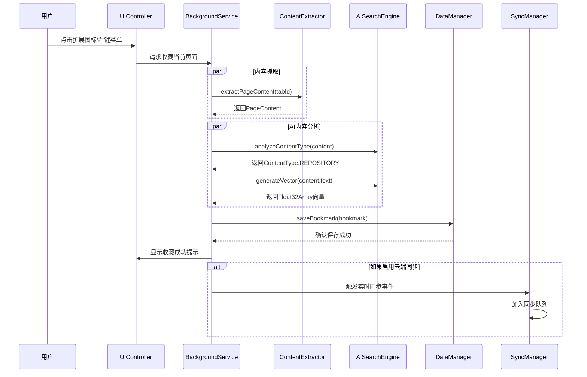
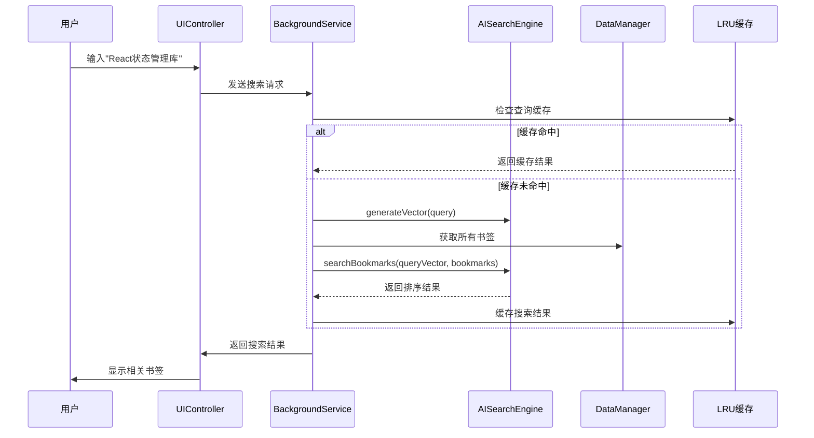

# Core Workflows

## 智能书签收藏工作流

```mermaid
sequenceDiagram
    participant User as 用户
    participant UI as UIController
    participant BG as BackgroundService
    participant CE as ContentExtractor
    participant AI as AISearchEngine
    participant DM as DataManager
    participant SM as SyncManager
    
    User->>UI: 点击扩展图标/右键菜单
    UI->>BG: 请求收藏当前页面
    
    par 内容抓取
        BG->>CE: extractPageContent(tabId)
        CE-->>BG: 返回PageContent
    end
    
    par AI内容分析
        BG->>AI: analyzeContentType(content)
        AI-->>BG: 返回ContentType.REPOSITORY
        BG->>AI: generateVector(content.text)
        AI-->>BG: 返回Float32Array向量
    end
    
    BG->>DM: saveBookmark(bookmark)
    DM-->>BG: 确认保存成功
    BG->>UI: 显示收藏成功提示
    
    alt 如果启用云端同步
        BG->>SM: 触发实时同步事件
        SM->>SM: 加入同步队列
    end
```

## AI语义搜索工作流

```mermaid
sequenceDiagram
    participant User as 用户
    participant UI as UIController
    participant BG as BackgroundService
    participant AI as AISearchEngine
    participant DM as DataManager
    participant Cache as LRU缓存
    
    User->>UI: 输入"React状态管理库"
    UI->>BG: 发送搜索请求
    
    BG->>Cache: 检查查询缓存
    alt 缓存命中
        Cache-->>BG: 返回缓存结果
    else 缓存未命中
        BG->>AI: generateVector(query)
        BG->>DM: 获取所有书签
        BG->>AI: searchBookmarks(queryVector, bookmarks)
        AI-->>BG: 返回排序结果
        BG->>Cache: 缓存搜索结果
    end
    
    BG->>UI: 返回搜索结果
    UI->>User: 显示相关书签
```
