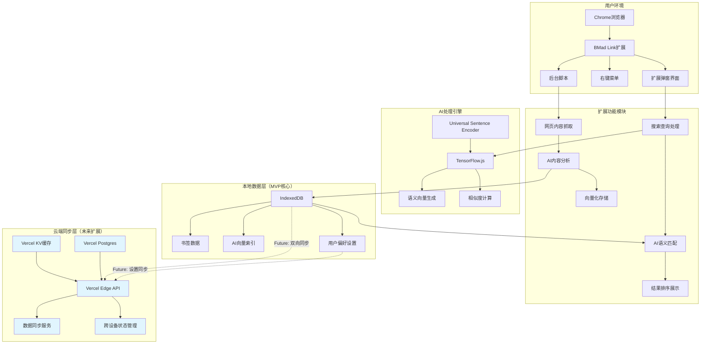

# High Level Architecture

## Technical Summary

BMad Link采用**本地优先的渐进式架构**，核心功能完全在Chrome扩展内运行，无需网络依赖。系统基于TensorFlow.js实现AI语义搜索，使用IndexedDB进行本地数据存储，通过TypeScript构建确保类型安全。MVP阶段专注本地功能，同时在数据层和服务层预留了云端同步的接口，支持未来的跨设备协作。前端采用现代Web Components模式，后端采用模块化的服务架构，整体设计围绕2秒内AI搜索响应和80%以上搜索成功率的性能目标。

## Platform and Infrastructure Choice

**平台选择：** Chrome扩展（主要） + Vercel Edge Functions（云端同步）  
**核心服务：** TensorFlow.js, IndexedDB, TypeScript, Webpack  
**云端扩展服务：** Vercel Functions, Vercel KV, Vercel Postgres  
**部署区域：** 全球边缘节点（Vercel Edge Network）

## Repository Structure

**结构选择：** Monorepo - 便于共享类型定义和工具配置  
**Monorepo工具：** Turborepo - 针对Vercel优化，构建缓存出色  
**包组织策略：** 
- `apps/extension` - Chrome扩展主应用
- `apps/sync-api` - 可选的云端同步API  
- `packages/shared` - 共享类型和工具
- `packages/ai-engine` - AI搜索引擎核心

## High Level Architecture Diagram

## Architectural Patterns

- **本地优先模式（Local-First Pattern）：** 所有核心功能在本地完成，云端仅作数据同步层 - _Rationale:_ 确保隐私安全和离线可用性，符合开发者用户需求
- **渐进增强架构（Progressive Enhancement）：** MVP完全本地运行，云端功能作为可选增强 - _Rationale:_ 降低初期开发复杂度，支持分阶段发布策略  
- **微前端组件模式（Micro-Frontend Components）：** 扩展UI基于独立组件构建 - _Rationale:_ 提高代码复用性，支持A/B测试和功能开关
- **事件驱动架构（Event-Driven Architecture）：** 本地数据变更通过事件通知云端同步 - _Rationale:_ 实现松耦合的同步机制，支持离线优先工作流
- **CQRS模式（Command Query Responsibility Segregation）：** 本地写操作和读操作分离，为云端同步优化 - _Rationale:_ 提高搜索性能，简化数据一致性处理
- **适配器模式（Adapter Pattern）：** 为云端同步预留统一的数据接口 - _Rationale:_ 支持多种云端服务提供商，保持架构灵活性
