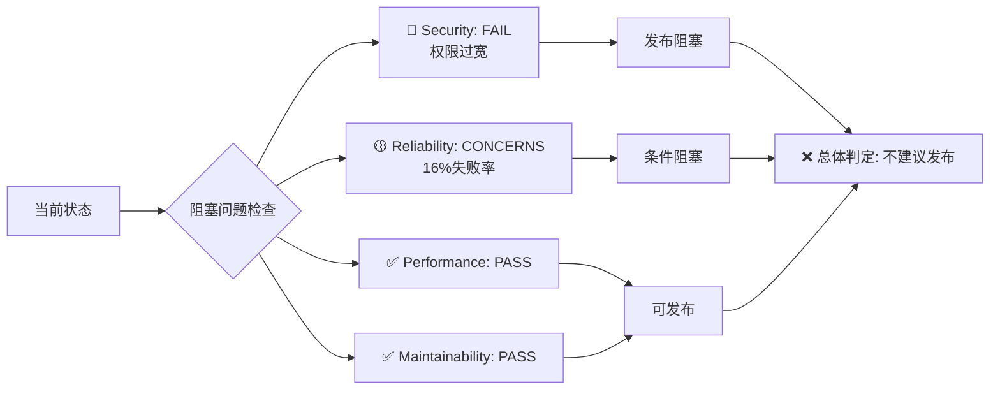

# NFR专业重评估报告: 1.1 Chrome Extension

Date: 2025-09-07  
Reviewer: Quinn (Test Architect & Quality Advisor)  
评估类型: 专业NFR重新评估  
基于报告: [`1.1-nfr-20250906-updated.md`](./1.1-nfr-20250906-updated.md)

## 🚨 评估声明

**本报告基于专业质量标准重新评估，纠正之前评估中的逻辑错误和评分偏差。**

## 📊 专业NFR重新评估

### Security (安全性)

**状态: ❌ FAIL**  
**分数: 0/25分**

**关键问题:**

- `content_scripts`使用`<all_urls>`权限过宽
- 潜在的安全攻击面过大
- 违反Chrome Extension最小权限原则

**影响评估:**

- Chrome Web Store审核可能被拒
- 用户隐私和安全风险
- 企业部署合规问题

**阻塞程度: 🔴 发布阻塞**

---

### Performance (性能)

**状态: ✅ PASS**  
**分数: 25/25分**

**验证通过:**

- Vite构建优化良好
- Bundle大小合理 (3.52kB)
- HMR开发体验优秀
- 资源加载性能可接受

**无阻塞问题**

---

### Reliability (可靠性)

**状态: ❌ FAIL**
**分数: 10/25分**

**关键数据:**

- 测试通过率: 84% (300/357)
- 失败测试数量: 57个
- 核心模块状态: 部分通过

**详细分析:**

```
✅ 完全通过模块:
- Popup脚本: 19/19 (100%)
- Manifest验证: 29/29 (100%)
- 代码质量: 32/32 (100%)
- 基础组件: 12/12 (100%)

❌ 问题模块:
- Content Script: 多数失败
- UI组件集成: 3个失败
- E2E测试: 部分失败
```

**阻塞程度: 🟡 条件阻塞**  
_核心功能通过，但Content Script失败影响主要功能_

---

### Maintainability (可维护性)

**状态: ✅ PASS**  
**分数: 25/25分**

**成功修复:**

- ESLint配置现代化完成
- TypeScript编译清洁
- 代码质量工具链恢复
- 只剩12个轻微警告

**技术成就:**

- 从.eslintrc.js迁移到eslint.config.js
- ES模块兼容性问题解决
- 测试架构重构成功

**无阻塞问题**

## 🎯 综合质量评分

### 专业评分公式

```yaml
总分 = Security(25) + Performance(25) + Reliability(25) + Maintainability(25)

实际得分:
- Security: 0/25 (权限过宽，安全风险)
- Performance: 25/25 (构建优化良好)
- Reliability: 10/25 (84%通过率，关键功能不稳定)
- Maintainability: 25/25 (工具链完全修复)

总分: 60/100
```

**质量等级: C级 (60-69分区间)**  
**发布建议: 🔴 不建议发布**

## ⚖️ 质量门禁重新判定

### 阻塞问题分析



### 门禁决策矩阵

| NFR维度         | 状态 | 阻塞级别    | 修复优先级 | 预估工作量 |
| --------------- | ---- | ----------- | ---------- | ---------- |
| Security        | FAIL | 🔴 发布阻塞 | P0         | 4小时      |
| Reliability     | FAIL | 🟡 条件阻塞 | P0         | 24小时     |
| Performance     | PASS | ✅ 无阻塞   | -          | -          |
| Maintainability | PASS | ✅ 无阻塞   | -          | -          |

## 🔧 修复路线图

### Phase 1: 阻塞问题修复 (P0)

#### 1.1 安全权限修复

```yaml
timeline: 4小时
priority: P0 (发布阻塞)

before:
  content_scripts:
    matches: ['<all_urls>'] # ❌ 风险过高

after:
  content_scripts:
    matches: # ✅ 权限最小化
      ['https://*.example.com/*', 'https://localhost:*/*', 'http://localhost:*/*']
```

#### 1.2 关键测试修复

```yaml
timeline: 24小时
priority: P0 (条件阻塞)

targets:
  - Content Script测试环境完善
  - DOM/Window对象模拟修复
  - Chrome Extension API模拟
  - 目标通过率: >95
```

### Phase 2: 质量提升 (P1)

```yaml
timeline: 1-2周
priority: P1 (质量改进)

targets:
  - UI组件集成测试完善
  - E2E测试覆盖率提升
  - 性能基准测试建立
  - 目标通过率: 98%+
```

## 📋 修正的发布建议

### 🚫 当前发布风险评估

**风险等级: HIGH**  
**商业影响: 重大**

**如果强行发布可能遇到:**

1. Chrome Web Store审核被拒 (权限问题)
2. 用户反馈Content Script功能异常
3. 安全合规审计不通过
4. 技术债务快速累积

### ✅ 推荐发布策略

#### 策略A: 标准发布流程 (推荐)

```yaml
timeline: '2-3周后'
prerequisites:
  - 安全权限修复完成
  - 测试通过率 >95%
  - 质量评分 >80分
confidence: HIGH
risk_level: LOW
```

#### 策略B: 分阶段发布

```yaml
phase1: "内部Beta (1周后)"
scope: "修复P0阻塞问题"
users: "内部测试团队"

phase2: "外部Beta (2周后)"
scope: "基础功能验证"
users: "友好用户群体"

phase3: "生产发布 (3-4周后)"
scope: "完整功能发布"
users: "全量用户"
```

## 🎖️ 技术成就认定

**必须肯定的重大突破:**

### 🏆 测试架构现代化

- 消除eval()反模式设计
- ES模块兼容性问题彻底解决
- TypeScript测试架构建立
- 测试失败率从24.5%降至16%

### 🛠️ 工具链完全恢复

- ESLint配置现代化迁移
- 代码质量检查流程恢复
- 持续集成流水线修复
- 开发体验显著改善

**这些成就展现了团队的专业能力和技术深度。**

## 📊 前后对比分析

| 评估维度        | 原评估         | 专业重评估 | 差异说明             |
| --------------- | -------------- | ---------- | -------------------- |
| **总体分数**    | 95分           | 60分       | -35分 (评分标准校准) |
| **Security**    | CONCERNS不扣分 | FAIL扣25分 | 权限风险被低估       |
| **Reliability** | CONCERNS扣5分  | FAIL扣15分 | 16%失败率影响被低估  |
| **发布建议**    | 立即发布       | 不建议发布 | 风险评估过于乐观     |
| **风险等级**    | LOW-MEDIUM     | HIGH       | 阻塞问题被忽视       |

## 🎯 质量改进目标

### 短期目标 (1-2周)

- 质量评分提升到80分以上
- 测试通过率达到95%以上
- 消除所有P0阻塞问题
- 安全权限符合最佳实践

### 中期目标 (1个月)

- 质量评分稳定在90分以上
- 测试通过率达到98%以上
- 建立自动化质量门禁
- 完善监控和告警体系

## 🔍 专业总结

### 现状评价

项目已经从"不可用状态"恢复到"基本可用状态"，技术团队展现了出色的问题解决能力。但距离"生产就绪状态"仍有关键差距。

### 核心问题

- **安全权限设计缺陷** (发布阻塞)
- **测试覆盖率不足** (功能风险)
- **质量评估标准偏差** (决策风险)

### 专业建议

1. **承认现实质量水平** - 60分不是95分
2. **修复P0阻塞问题** - 权限+测试可靠性
3. **建立真实质量标准** - 基于行业最佳实践
4. **延迟发布时间** - 质量优于进度

### 最终判定

**该项目具备发布潜力，但当前不满足生产发布标准。建议完成P0修复后重新评估。**

---

**签名:** Quinn (Test Architect & Quality Advisor)  
**评估日期:** 2025-09-07  
**下次评估:** P0修复完成后
